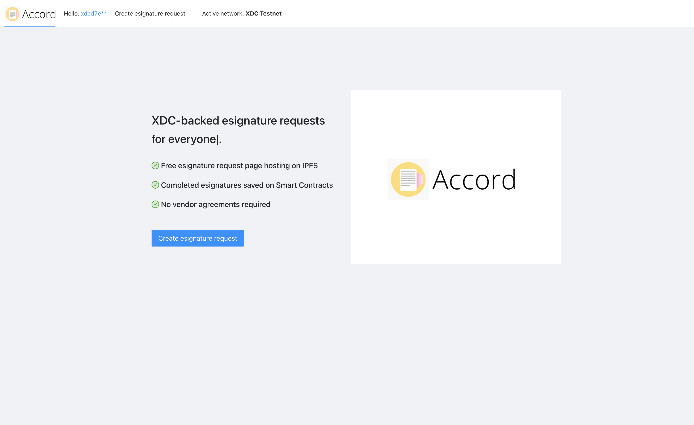
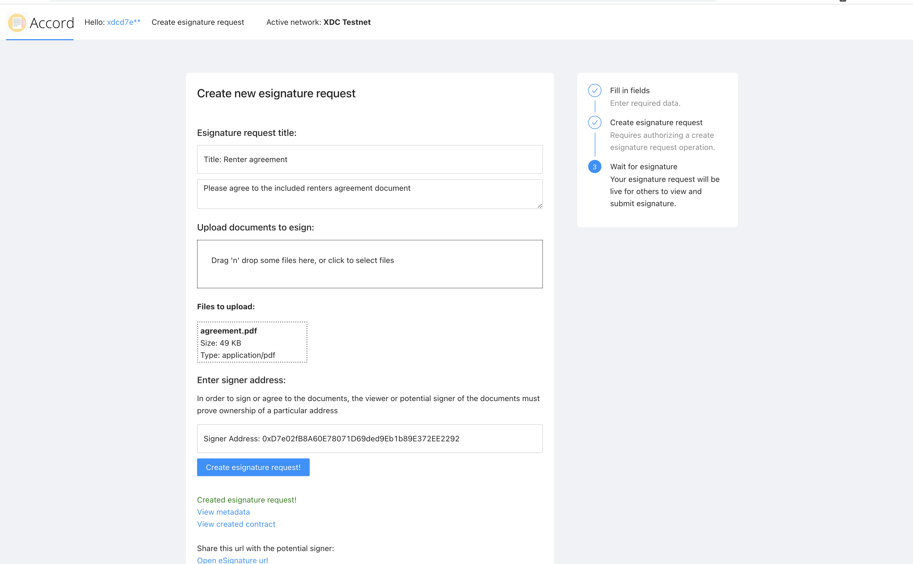
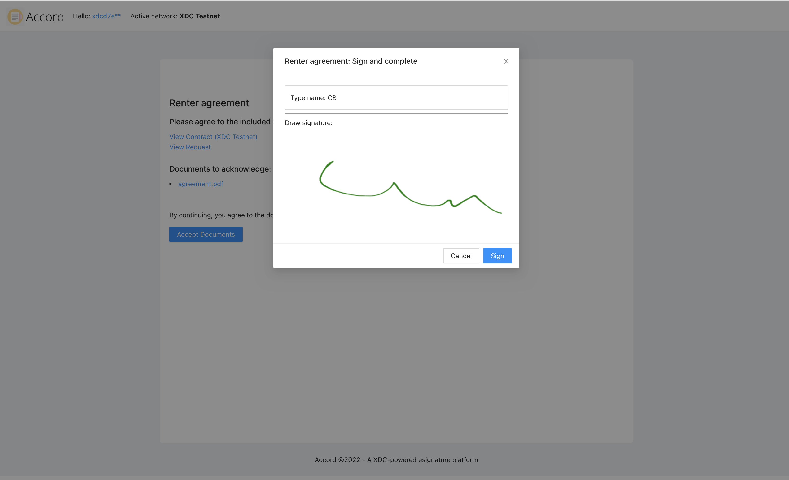
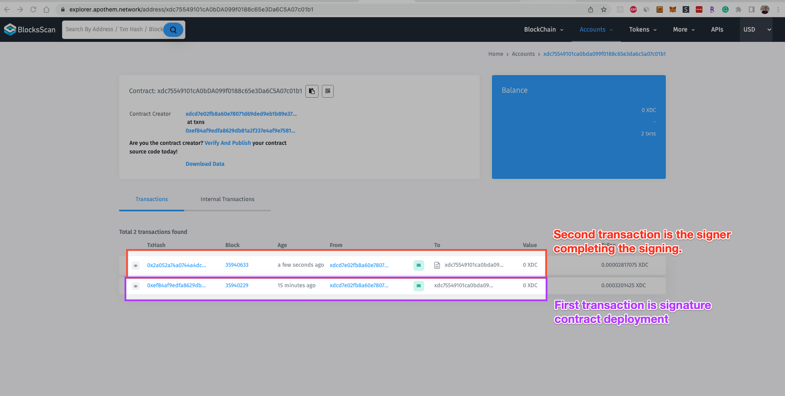
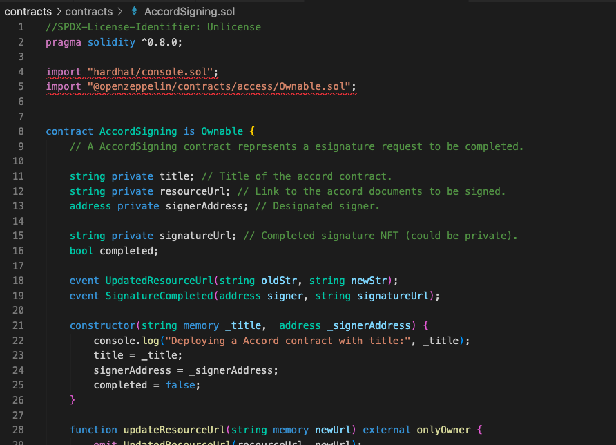

 

    

 

### Accord

Accord is a ported dapp for producing sending and accepting document agreements on smart contracts, with signatures minted as NFTs. Enables Docusign-like capabilities and use-cases using web3 infrastructure to set up and collect signed document agreements on the XDC Apothem testnet or XDC mainnet.

<!-- 
Try it out <a href="accord.surge.sh" target="_blank">here</a>! (requires Metamask connected to XDC testnet).

Demo video: 
-->

### Benefits

- Accord enables anyone to create and collect esignature against documents without a vendor agreement. An XDC smart contract is deployed for each esignature request.
- Each packet of documents for esignature is made accessible at an IPFS url.
- When the esignature is completed, an NFT is generated that links both the signer's signature and the documents being agreed on.
- Hosted documents and the request are immutable.
- Smart contract deployed on XDC marks the progress/fulfillment of the esignature request. The contract can only be marked completed by the designated signer address at the time of final signature.
- An individual in the context of the Accord application is the pairing of a canvas (handwritten) signature and wallet signature/address.
- Wallet addresses are used as the source of identity instead of traditional means like username/password pairs and email addresses. Users attempting to access an esignature request without being under the assigned signer address are denied access.

### Technologies used

<!-- <b>This project is a hackathon prototype and would require additional work / deployment to be production ready. -->

---

To run/demo the project locally, Accord requires the following environment variables.

<pre>
    REACT_APP_NFT_PORT_KEY={YOUR_NFT_PORT_API_KEY} # NFT port api key for NFT signature receipt creation.
    REACT_APP_STORAGE_KEY={YOUR_WEB3_STORAGE_KEY} # web3.storage key for file hosting.
    REACT_APP_USE_MAINNET={false/true} # (Optional) String boolean indicating whether the XDC mainnet should be used. Defaults to false (testnet) if unset.
</pre>

---

After declaring the above environment variables, use the below command to start the project:
`yarn; yarn start`

Recompiling Accord contract:
`cd contracts; npx hardhat compile`

<!--
Sponsors:
XDC - Deploys a smart contract for esign.
NFTport - Signature NFT creation on xdc.

Demo flow:
Show docusign site / discuss industry baseline
Show Accord.
Create an esign request
Submit (Can be metamask or sequence wallet)
Show result (xdc contract)
View the completed assets (xdc, contract interaction, nftport)
Github

-->

### Screenshots

#### Home page

#### Creating a request

### Request saved via IPFS (both the docs and request metadata).

### Esigning

### Both the creation of the request and the signature get saved as events on a smart contract

<!-- ### Completion esignature NFT

 -->

### Contract source

### Useful links
https://howto.xinfin.org/general/networks/
